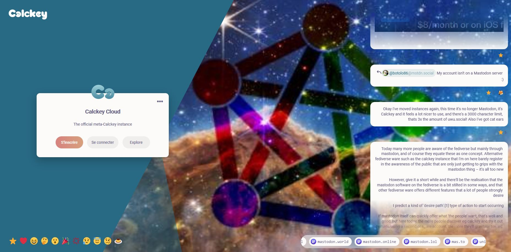

<!--
N.B.: This README was automatically generated by https://github.com/YunoHost/apps/tree/master/tools/README-generator
It shall NOT be edited by hand.
-->

# Firefish pour YunoHost

[](https://dash.yunohost.org/appci/app/firefish)  

[](https://install-app.yunohost.org/?app=firefish)

*[Read this readme in english.](./README.md)*

> *Ce package vous permet d’installer Firefish rapidement et simplement sur un serveur YunoHost.
Si vous n’avez pas YunoHost, regardez [ici](https://yunohost.org/#/install) pour savoir comment l’installer et en profiter.*

## Vue d’ensemble

Un fork grandement amélioré de Misskey avec une meilleure UI/UX, sécurité, fonctionnalités, et plus encore !


    Firefish est basé sur Misskey, un puissant serveur de microblogging sur ActivityPub avec des fonctionnalités telles que des réactions emoji, une interface web personnalisable, des discussions riches, et bien plus encore !
    Firefish ajoute de nombreux changements de qualité de vie et des corrections de bogues pour les utilisateurs et les administrateurs d'instance.


**Version incluse :** 1.0.3~ynh1

**Démo :** https://i.calckey.cloud/

## Captures d’écran



## Documentations et ressources

* Site officiel de l’app : <https://i.calckey.cloud/>
* Dépôt de code officiel de l’app : <https://codeberg.org/calckey/calckey>
* Documentation YunoHost pour cette app : <https://yunohost.org/app_firefish>
* Signaler un bug : <https://github.com/YunoHost-Apps/firefish_ynh/issues>

## Informations pour les développeurs

Merci de faire vos pull request sur la [branche testing](https://github.com/YunoHost-Apps/firefish_ynh/tree/testing).

Pour essayer la branche testing, procédez comme suit.

``` bash
sudo yunohost app install https://github.com/YunoHost-Apps/firefish_ynh/tree/testing --debug
ou
sudo yunohost app upgrade firefish -u https://github.com/YunoHost-Apps/firefish_ynh/tree/testing --debug
```

**Plus d’infos sur le packaging d’applications :** <https://yunohost.org/packaging_apps>