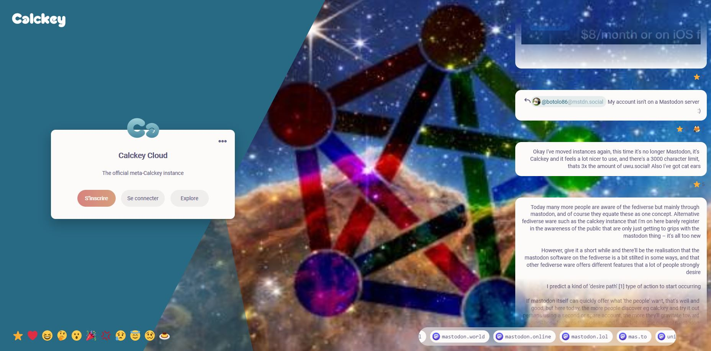

<!--
N.B.: README ini dibuat secara otomatis oleh <https://github.com/YunoHost/apps/tree/master/tools/readme_generator>
Ini TIDAK boleh diedit dengan tangan.
-->

# Calckey untuk YunoHost

[](https://ci-apps.yunohost.org/ci/apps/calckey/)  

[](https://install-app.yunohost.org/?app=calckey)

*[Baca README ini dengan bahasa yang lain.](./ALL_README.md)*

> *Paket ini memperbolehkan Anda untuk memasang Calckey secara cepat dan mudah pada server YunoHost.*  
> *Bila Anda tidak mempunyai YunoHost, silakan berkonsultasi dengan [panduan](https://yunohost.org/install) untuk mempelajari bagaimana untuk memasangnya.*

## Ringkasan


A greatly enhanced fork of Misskey with better UI/UX, security, features, and more! https://i.calckey.cloud/


    Calckey is based off of Misskey, a powerful microblogging server on ActivityPub with features such as emoji reactions, a customizable web UI, rich chatting, and much more!
    Calckey adds many quality of life changes and bug fixes for users and instance admins alike.
   


**Versi terkirim:** 13.1.4.1~ynh1

**Demo:** <https://i.calckey.cloud/>

## Tangkapan Layar



## :red_circle: Antifitur

- **Upstream not maintained**: Calckey has been replaced by Firefish, install that new app instead. A migration procedure is being developed for existing instances.

## Dokumentasi dan sumber daya

- Website aplikasi resmi: <https://i.calckey.cloud/>
- Depot kode aplikasi hulu: <https://codeberg.org/calckey/calckey>
- Gudang YunoHost: <https://apps.yunohost.org/app/calckey>
- Laporkan bug: <https://github.com/YunoHost-Apps/calckey_ynh/issues>

## Info developer

Silakan kirim pull request ke [`testing` branch](https://github.com/YunoHost-Apps/calckey_ynh/tree/testing).

Untuk mencoba branch `testing`, silakan dilanjutkan seperti:

```bash
sudo yunohost app install https://github.com/YunoHost-Apps/calckey_ynh/tree/testing --debug
atau
sudo yunohost app upgrade calckey -u https://github.com/YunoHost-Apps/calckey_ynh/tree/testing --debug
```

**Info lebih lanjut mengenai pemaketan aplikasi:** <https://yunohost.org/packaging_apps>
